<!-- @format -->

# thriftfmt

**thriftfmt** is a command-line tool for formatting [Apache Thrift](https://thrift.apache.org/) files.  
It provides consistent, customizable, and readable formatting for Thrift IDL files, making code reviews and collaboration easier.

## Features

- **Automatic Formatting:** Standardizes indentation, field delimiters, and comment placement for Thrift files.
- **Comment Awareness:** Correctly associates comments with the right fields, supporting both leading and trailing comments.
- **Customizable:** Supports options for indentation, field delimiters, and required field patching.
- **Batch Processing:** Can recursively format all Thrift files in a directory.
- **IDE Integration:** Easily integrates with Goland and VS Code for seamless formatting on save.
- **Based on [cloudwego/thriftgo](https://github.com/cloudwego/thriftgo):** Uses a robust PEG grammar and parser foundation.

## Why Use thriftfmt?

- Ensures consistent Thrift file style across teams and projects.
- Reduces merge conflicts and improves code readability.
- Saves time on manual formatting and code review discussions.

对 Thrift 文件进行格式化的工具。

- Thrift PEG 定义使用的是 [cloudwego/thriftgo](https://github.com/cloudwego/thriftgo.git) 中的 [thrift.peg](https://github.com/cloudwego/thriftgo/blob/main/parser/thrift.peg)
- `parser` 的实现基于 [cloudwego/thriftgo/parser](https://github.com/cloudwego/thriftgo/blob/main/parser/parser.go) 做了优化，能同时识别 位于顶部+尾部的 comment，这在一定程度上解决了**某一个 field 被注释后会被当成下一个 field 的注释**的让人费解的表现。具体效果参考后文的效果展示。

## 安装

```shell
go install github.com/hujm2023/thriftfmt@latest
```

## 使用

```shell
Usage of thriftfmt:
    -e, --enumFieldDelimiter string      delimiter for enum fields. (default ",")
        --indent int                     indentation level for indentation of struct fields. (default 4)
        --overwrite                      if true will overwrite existing file. (default false)
        --patchRequired                  if true will patch the miss required for field in struct or others. (default false)
    -f, --serviceFieldDelimiter string   delimiter for service fields. (default ",")
    -s, --structFieldDelimiter string    delimiter for struct fields. (default ",")
        --verbose                        if true will print the processing logs. (default false)

# 对 ./idl/base.thrift 进行格式化
thriftfmt ./idl/base.thrift
# 将format后的结果覆盖源文件
thriftfmt ./idl/base.thrift --overwrite
# 对整个文件夹进行格式化(当目标是文件夹时，默认递归处理文件夹下所有 thrift 文件，并覆盖写入)
thriftfmt ./idl
```

## 效果

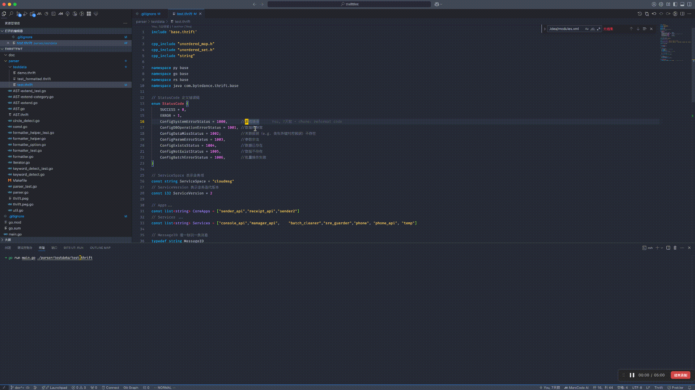

## Format 功能介绍

### namespace 支持注解

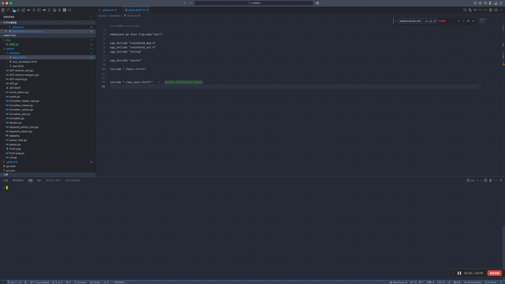

### Enum 各种注释支持

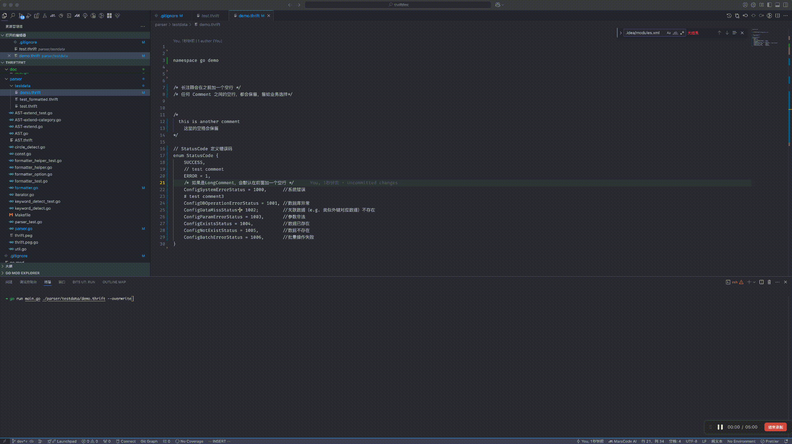

### Const list/map 支持换行展示

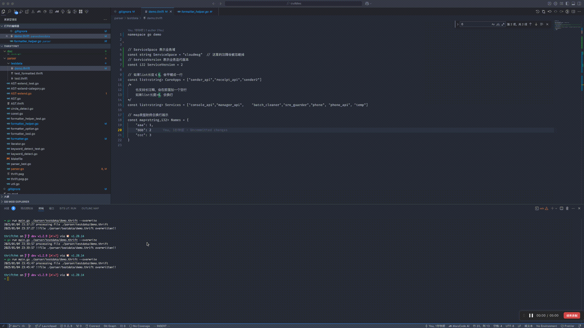

### Struct 支持各种方式注释，也支持注解

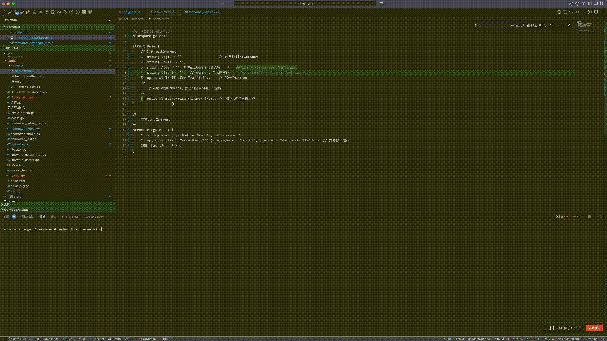

### Service 支持方法尾部注释，支持注解，也支持 oneway/void 关键字

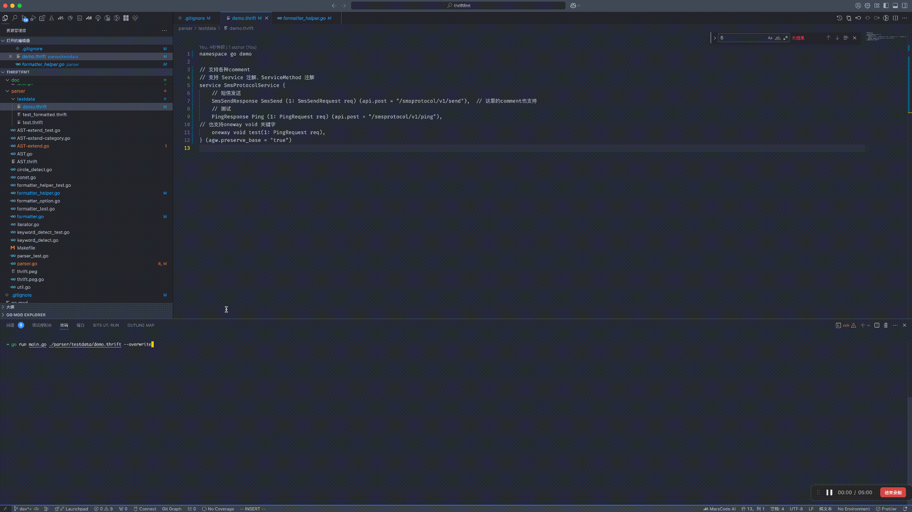

## IDE 集成

### Goland

#### step1: 确保你的 Editor/File Types/Thrift interface definition 的后缀设置正确

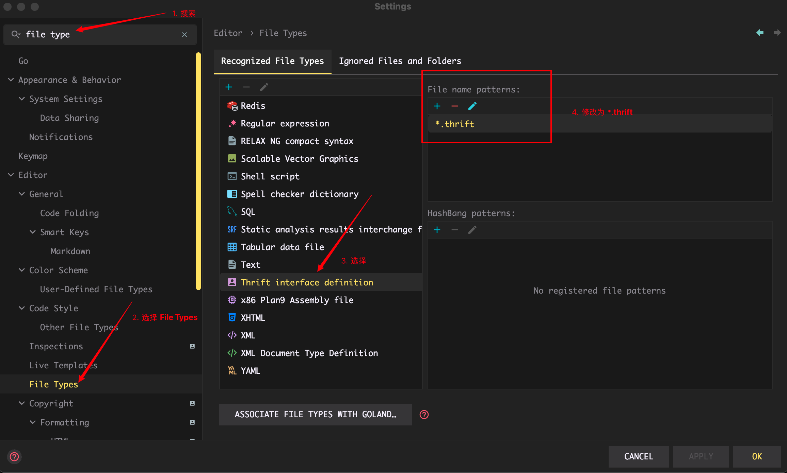

#### step2: 增加 file watcher 配置

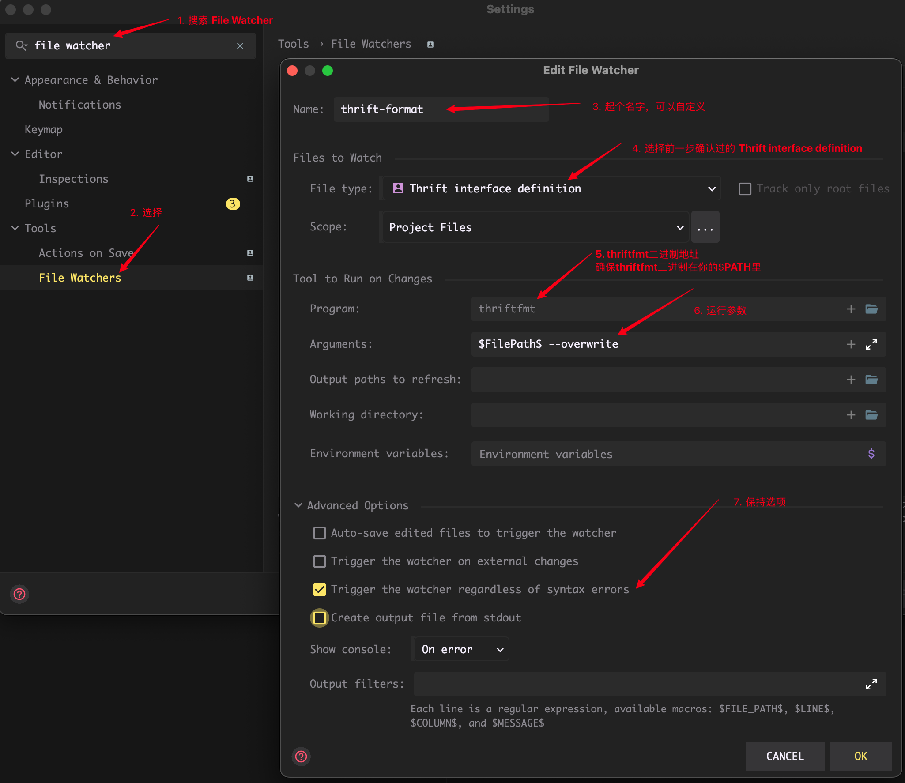

### step3: 开始使用—— 做出任意修改 && Command+S 保存 ==> Format

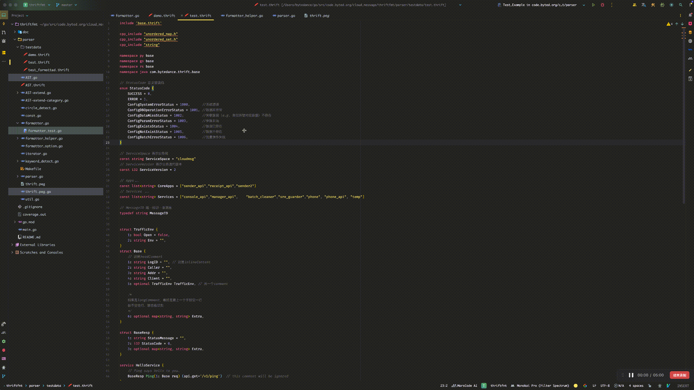

### VS Code

#### step1: 项目下创建 ./vscode/tasks.json 文件

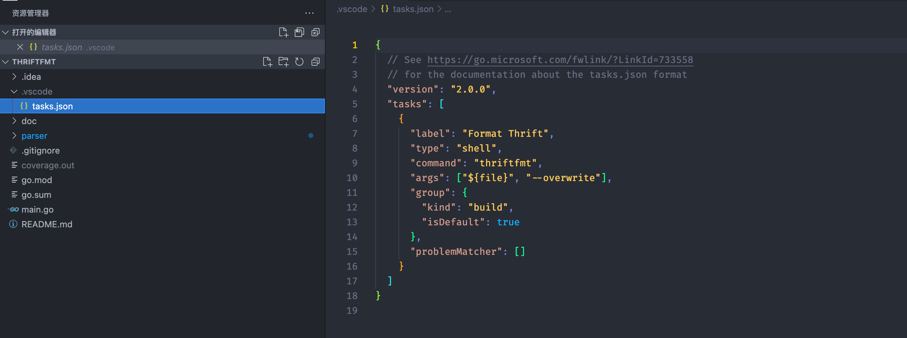

```json
{
  // See https://go.microsoft.com/fwlink/?LinkId=733558
  // for the documentation about the tasks.json format
  "version": "2.0.0",
  "tasks": [
    {
      "label": "thriftfmt",
      "type": "shell",
      "command": "thriftfmt",
      "args": ["${file}", "--overwrite"],
      "group": {
        "kind": "build",
        "isDefault": true
      },
      "problemMatcher": []
    }
  ]
}
```

#### step2: Command+P && “运行任务” && 选择 thriftfmt ==> Format

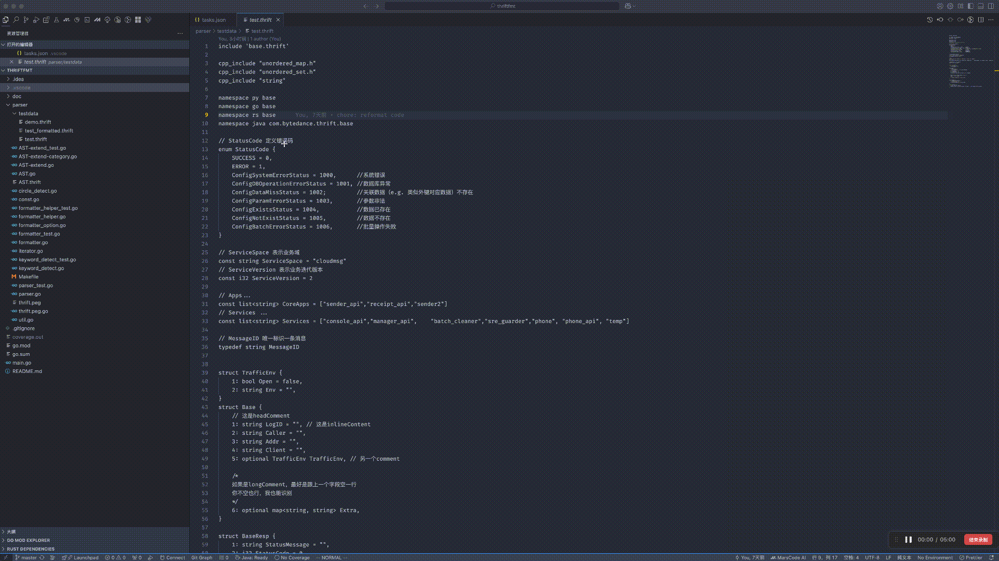
